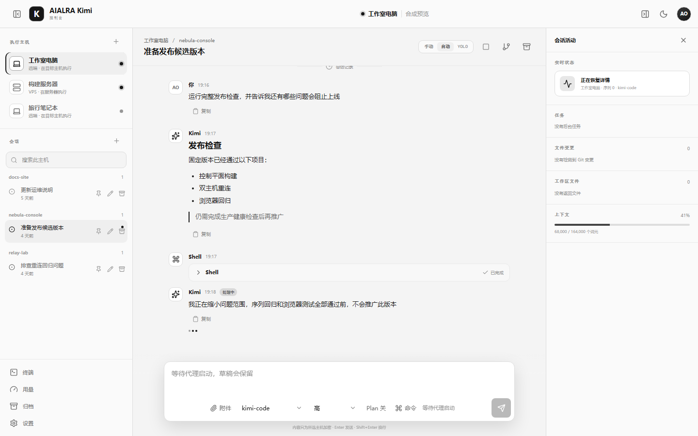
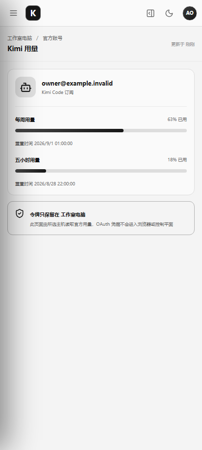
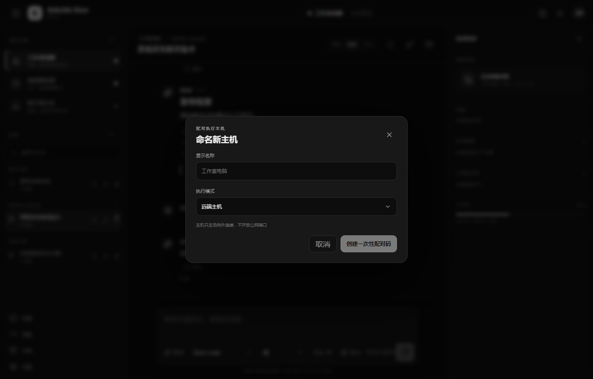
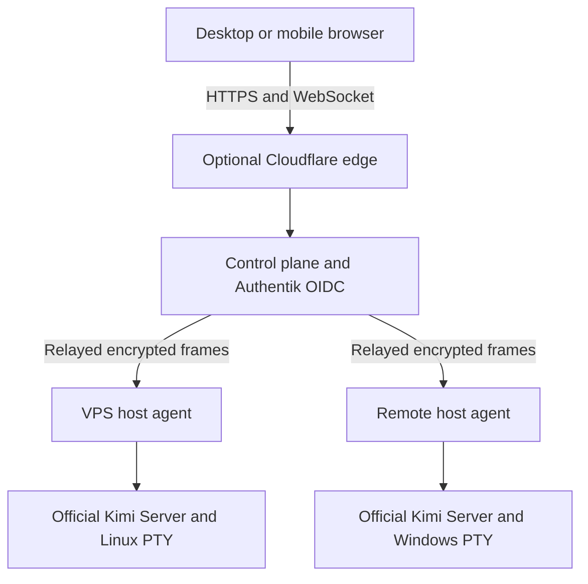

<div align="center">


<h1>AIALRA-KIMI</h1>

<p><strong>A self-hosted interface for native Kimi Code sessions on VPS and remote hosts</strong></p>

<p>Single owner · Windows and Linux execution hosts · Any modern browser</p>

<p><strong>v0.1.0 pre-release</strong> · Kimi Code 0.39.1 · MIT</p>

<p>
  <a href="#3-quick-start">Quick start</a> ·
  <a href="#5-system-architecture">Architecture</a> ·
  <a href="#6-security-and-data-boundaries">Security</a> ·
  <a href="#8-validation-status">Validation</a> ·
  <a href="SECURITY.md">Security reports</a>
</p>

<p><a href="README.md">简体中文</a> · <a href="README.en.md">English</a></p>

</div>

<picture>
  <source media="(prefers-color-scheme: dark)" srcset="docs/assets/readme/hero-dark.png">
  <source media="(prefers-color-scheme: light)" srcset="docs/assets/readme/hero-light.png">
  
</picture>

<div align="center">

Figure 1. Desktop interface rendered entirely from synthetic data, with separate local assets for light and dark themes

</div>

## 1. Project value

AIALRA-KIMI provides a maintainable independent Web interface connected through a restricted control plane to official Kimi Servers on Windows and Linux hosts

The browser can switch execution hosts, resume native Kimi sessions, handle approvals and questions, inspect tasks, file changes, context, and account usage, and open standard or time-limited elevated terminals

> [!WARNING]
> This project can execute code remotely and open privileged terminals, and v0.1.0 is still a pre-release
> Start with the `?demo=1` synthetic preview or an isolated host, and do not connect production data before validating identity, backup, rollback, and network controls

### 1.1. Why the official Web bundle is not modified

The Kimi Code repository ships compiled Web assets synchronized from an internal application, not maintainable frontend source

This project neither patches minified assets nor copies the official Web UI; it builds an independent interface and compatibility layer over the official REST and WebSocket protocols

### 1.2. Intended users

- Individual Kimi Code subscribers who want to continue a host session from a phone or another computer
- Self-hosters who need VPS and personal workstations in one control surface
- Operators prepared to maintain Authentik, TLS, backups, and host-agent security boundaries

## 2. Core capabilities

<div align="center">

| Capability         | Observable result                                                           | Current status                                                  |
| ------------------ | --------------------------------------------------------------------------- | --------------------------------------------------------------- |
| Multi-host control | Switch between VPS and remote Windows or Linux hosts                        | Implemented; private deployment has connected both host classes |
| Kimi sessions      | Full transcript, search, create, resume, archive, fork, stream, and recover | Implemented with contract and browser coverage                  |
| Interactions       | Keep approvals, questions, tasks, file changes, and context synchronized    | Implemented with protocol coverage                              |
| Permission modes   | Separate per-session `manual / auto / yolo` from the new-session default    | Implemented with desktop and mobile browser coverage            |
| Official usage     | Query account summary, rate windows, and reset times on the selected host   | Implemented; OAuth tokens never return to the browser           |
| Terminals          | Windows CMD or PowerShell and Linux shells with resize, Unicode, and resume | Implemented; full cold-boot acceptance remains                  |
| Elevation          | Linux `sudo -k -i` and a separate Windows LocalSystem broker                | Implemented; use still requires separate step-up authentication |

Table 2.1. v0.1.0 core capabilities

</div>

## 3. Quick start

The safest first success is the local synthetic preview, which connects to no Kimi account, remote host, or production identity system

Prerequisites:

- Node.js 24.15.x
- pnpm 10.33.x
- An installed Chromium browser

```bash
git clone https://github.com/AIALRA-0/AIALRA-KIMI.git # Fetch the public core repository
cd AIALRA-KIMI # Enter the repository before using its pinned toolchain
corepack enable # Select the pnpm version declared by packageManager
pnpm install --frozen-lockfile # Install the exact dependency graph
pnpm --filter @aialra-kimi/web dev # Start only the local Web development server
```

Append `?demo=1` to the local URL printed in the terminal

Expected result: the browser shows three synthetic hosts, three synthetic sessions, permission modes, account usage, and a terminal entry without opening a real control-plane connection

See [Deployment](docs/deployment.md) for production preparation and [Contributing](CONTRIBUTING.md) for development checks

## 4. User flow

### 4.1. Host modes

| Mode     | Execution location                                      | Network entry                                 | Typical use                                       |
| -------- | ------------------------------------------------------- | --------------------------------------------- | ------------------------------------------------- |
| `vps`    | Kimi Server and shell on the VPS                        | The agent only dials out to the control plane | Remote builds, maintenance, and long-running work |
| `remote` | Kimi Server and shell on a remote Windows or Linux host | The agent only dials out to the control plane | Continue that host's local sessions and workspace |

Both modes use the same agent protocol; changing mode means selecting another target host rather than switching implementations

### 4.2. Pair a host

The owner first creates a ten-minute, single-use pairing code in the Web interface, then enrolls the target host

```bash
aialra-kimi-agent enroll \
  --server https://kimi.example.com \
  --code EXAMPLE-CODE \
  --name "Studio workstation" \
  --mode remote \
  --kimi-executable kimi # Enroll through an example domain and a one-time placeholder code
```

Install the per-user background service only after enrollment, then complete official Kimi OAuth login on the target host

### 4.3. Control a session

1. Select a host that clearly identifies its execution location
2. Create or resume a session and choose `manual`, `auto`, or `yolo`
3. Handle Kimi approvals, questions, tasks, and file changes
4. Open a terminal separately, and complete short-lived step-up authentication before elevation
5. When a host is offline, use only sanitized metadata; message, file, and terminal access stays disabled

<table>
  <tr>
    <td width="33%"></td>
    <td width="67%"></td>
  </tr>
  <tr>
    <td align="center">Figure 4.1. Mobile account usage</td>
    <td align="center">Figure 4.2. Outbound-only host pairing</td>
  </tr>
</table>

Every host, session, account, usage value, date, and workspace in these images is synthetic

## 5. System architecture



Figure 5.1. Browser and agent establish ephemeral X25519 channels; the control plane relays XChaCha20-Poly1305 ciphertext

Complete sessions, terminal content, and file bodies remain on the selected host

The control plane stores host registration, audit categories, and encrypted session titles, timestamps, states, and sanitized workspace aliases; it does not store prompts, answers, terminal content, file bodies, or absolute paths

See [Architecture](docs/architecture.md) for components, protocols, and failure behavior

## 6. Security and data boundaries

### 6.1. Secure defaults

- OIDC uses Authorization Code with PKCE and authorizes by owner group
- Agents generate Ed25519 host identities; Windows protects the private key with DPAPI and Linux uses `0600` permissions
- Browser and agent encrypt Kimi and terminal frames end to end and reject replayed or out-of-order sequence numbers
- The control plane does not offer arbitrary localhost proxying; only declared Kimi and terminal operations are accepted
- Passwords travel only as encrypted terminal input to the target host and are excluded from logs, databases, and browser storage
- Elevated terminals enforce failure throttling, idle timeout, maximum lifetime, and disconnect destruction
- Logs contain only user, host, action category, timestamps, result, and request ID

### 6.2. Residual risk

If the control plane serving the frontend is compromised, malicious frontend code may read a password before encryption

Production deployments must isolate the elevation page, forbid third-party scripts and service workers, apply strict CSP and no-store policy, and verify SRI, signed artifacts, and release hashes

Review [Threat model](docs/threat-model.md) for assets, attack surfaces, and mitigations, and report vulnerabilities privately through [SECURITY.md](SECURITY.md)

## 7. Deployment, upgrades, and rollback

The public repository builds, tests, attests, and publishes artifacts; production inventory, object identifiers, secret references, deployment receipts, and rollback state belong in a separate private operations repository

Recommended deployment order:

1. Identity
2. TLS and edge
3. Control plane
4. Host enrollment
5. Kimi OAuth
6. Backup and restore drill
7. Real end-to-end validation

Every upgrade pins the Kimi tag, commit, release SHA-256 values, OpenAPI hash, and AsyncAPI hash

An incompatible version becomes `unsupported` and cannot be controlled; promotion remains manual until contract, browser, and security checks pass

Rollback selects an immutable prior release through an atomic `current` pointer, restores service, reverse-proxy, database snapshot, and object state, then reruns health checks

See [Deployment](docs/deployment.md) for configuration and acceptance gates

## 8. Validation status

The table lists the current validation entry points and their evidence boundaries without embedding fast-expiring test counts; every release must use the current revision's local output, GitHub CI, and private deployment receipt. These checks do not imply that every production environment has completed cold-boot acceptance

<div align="center">

| Target                       | Method                  | Current result                      | Evidence boundary                                         |
| ---------------------------- | ----------------------- | ----------------------------------- | --------------------------------------------------------- |
| TypeScript workspace         | `pnpm test`             | Use current command output          | Protocol, crypto, identity, database, and UI state models |
| Rust host agent              | `cargo test`            | Use current command output          | Windows and Linux targets checked separately              |
| Desktop and mobile browser   | `pnpm test:e2e`         | Use current command output          | Chromium synthetic core flows                             |
| README synthetic screenshots | `pnpm docs:screenshots` | Use current command output          | Desktop light, desktop dark, mobile, and pairing flow     |
| Upstream compatibility lock  | `pnpm check:upstream`   | Use current lock and command output | Kimi Server API remains experimental upstream             |

Table 8.1. Current validation scope

</div>

## 9. Project status and limits

The project is in the v0.1.0 large-scale finishing stage; source, control plane, and both host-agent classes form a usable loop, while the current focus is real-use feedback, OAuth persistence after service restarts, and staged full-host cold-boot acceptance

The v1 scope is single-owner and excludes multi-tenancy, macOS agents, full remote desktop, cross-host session migration, complete offline message mirroring, a Codex execution engine, and remote third-party provider-key configuration

Future Kimi Code versions may change the experimental Kimi Server protocol; upgrades must pass `upstream.lock.json`, adapter, and contract checks

## 10. Maintenance and license

- Reproducible defects: [GitHub Issues](https://github.com/AIALRA-0/AIALRA-KIMI/issues)
- Security reports: [SECURITY.md](SECURITY.md)
- Contribution workflow: [CONTRIBUTING.md](CONTRIBUTING.md)
- License terms: [MIT License](LICENSE)
- Third-party notices: [THIRD_PARTY_NOTICES.md](THIRD_PARTY_NOTICES.md)

AIALRA-KIMI is an independent, unofficial project and is not produced, sponsored, or endorsed by Moonshot AI

Kimi Code is the work of Moonshot AI and its contributors; this project interoperates with the official release pinned in `upstream.lock.json` and does not copy official Web UI assets
