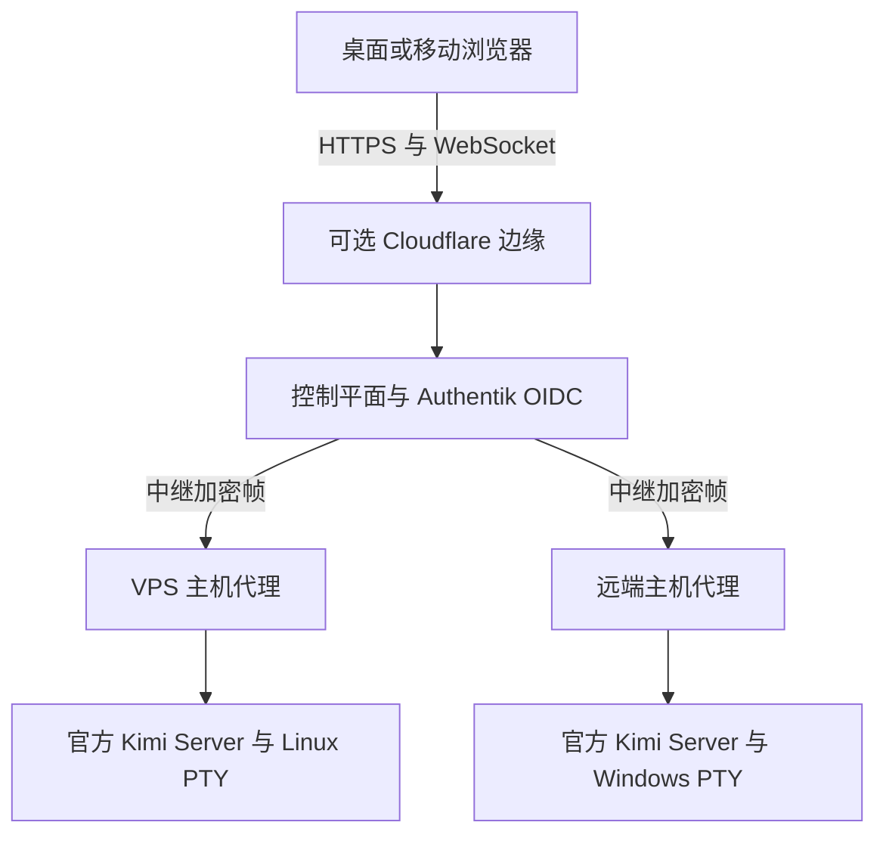

<div align="center">


<h1>AIALRA-KIMI</h1>

<p><strong>用一套自托管界面操纵 VPS 与远端主机上的原生 Kimi Code</strong></p>

<p>单所有者 · Windows 与 Linux 执行主机 · 任意现代浏览器</p>

<p><strong>v0.1.0 预发布</strong> · Kimi Code 0.39.1 · MIT</p>

<p>
  <a href="#3-快速开始">快速开始</a> ·
  <a href="#5-系统架构">系统架构</a> ·
  <a href="#6-安全与数据边界">安全边界</a> ·
  <a href="#8-验证状态">验证状态</a> ·
  <a href="SECURITY.md">安全报告</a>
</p>

<p><a href="README.md">简体中文</a> · <a href="README.en.md">English</a></p>

</div>

<picture>
  <source media="(prefers-color-scheme: dark)" srcset="docs/assets/readme/hero-dark.png">
  <source media="(prefers-color-scheme: light)" srcset="docs/assets/readme/hero-light.png">
  
</picture>

<div align="center">

图 1 使用完全合成数据生成的桌面界面，亮色与暗色主题使用各自的本地截图

</div>

## 1. 项目价值

AIALRA-KIMI 重建了一个可维护的独立 Web 前端，通过受限控制平面连接运行官方 Kimi Server 的 Windows 或 Linux 主机

浏览器可以切换执行主机，恢复原生 Kimi 会话，处理审批和问题，查看任务、文件变化、上下文与账户用量，并使用普通或限时提权终端

> [!WARNING]
> 本项目可以远程执行代码和打开高权限终端，v0.1.0 仍是预发布版本
> 第一次运行应使用 `?demo=1` 合成演示或隔离主机，不要在完成身份、备份、回滚和网络门禁前接入生产数据

### 1.1. 为什么不修改官方 Web 资源

Kimi Code 仓库发布的是从内部应用同步的编译后 Web 资源，没有可维护的前端源码

本项目不修改压缩资源，也不复制官方 Web UI，而是使用官方 REST 与 WebSocket 协议建立独立界面和兼容层

### 1.2. 当前适合谁

- 已订阅 Kimi Code，希望从手机或其他电脑继续同一主机会话的单个所有者
- 需要把 VPS 和个人工作站放进同一控制界面的自托管使用者
- 愿意维护 Authentik、TLS、备份和主机代理安全边界的运维人员

## 2. 核心能力

<div align="center">

| 能力       | 可观察结果                                                       | 当前状态                            |
| ---------- | ---------------------------------------------------------------- | ----------------------------------- |
| 多主机控制 | 同一界面切换 VPS 与远端 Windows／Linux 主机                      | 已实现，私有部署已完成双主机联通    |
| Kimi 会话  | 完整转录、搜索、创建、恢复、归档、分叉、流式事件与断线续接       | 已实现并通过契约与浏览器测试        |
| 交互处理   | 审批、问题、任务、文件变化和上下文状态保持同步                   | 已实现并通过协议测试                |
| 权限模式   | 当前会话 `manual / auto / yolo` 三态与新会话默认值分离           | 已实现并通过桌面与移动浏览器测试    |
| 官方用量   | 从目标主机查询账户摘要、频率窗口和重置时间                       | 已实现，不把 OAuth Token 返回浏览器 |
| 终端       | Windows CMD／PowerShell 与 Linux Shell，支持尺寸、Unicode 和续接 | 已实现，整机冷启动仍需最终验收      |
| 提权终端   | Linux `sudo -k -i` 与独立 Windows LocalSystem Broker             | 已实现，使用时仍要求独立二次认证    |

表 2.1. v0.1.0 核心能力

</div>

## 3. 快速开始

最安全的第一次成功是本地合成演示，它不会连接 Kimi 账户、远端主机或生产身份系统

前置条件包括：

- Node.js 24.15.x
- pnpm 10.33.x
- 已安装的 Chromium 浏览器

```bash
git clone https://github.com/AIALRA-0/AIALRA-KIMI.git # 获取公开核心仓库
cd AIALRA-KIMI # 进入仓库后再运行锁定工具链
corepack enable # 使用 packageManager 字段固定的 pnpm 版本
pnpm install --frozen-lockfile # 按锁文件安装依赖
pnpm --filter @aialra-kimi/web dev # 只启动本地 Web 开发服务器
```

在终端显示的本地地址后添加 `?demo=1`

成功启动后，浏览器会显示三个合成主机、三条合成会话、权限模式、账户用量和终端入口，同时不会发起真实控制平面连接

完整生产准备见 [部署说明](docs/deployment.md)，开发与测试命令见 [贡献说明](CONTRIBUTING.md)

## 4. 使用流程

### 4.1. 两种主机模式

| 模式     | 实际执行位置                    | 网络入口               | 典型用途                       |
| -------- | ------------------------------- | ---------------------- | ------------------------------ |
| `vps`    | VPS 本机的 Kimi Server 与 Shell | 代理只主动连接控制平面 | 远程构建、维护和长期任务       |
| `remote` | Windows 或 Linux 远端主机       | 代理只主动连接控制平面 | 继续该主机上的本地会话与工作区 |

两个模式使用同一代理协议，切换模式就是切换目标主机，不存在两套会话实现

### 4.2. 配对主机

所有者先在 Web 中生成十分钟有效的一次性配对码，再在目标主机执行注册

```bash
aialra-kimi-agent enroll \
  --server https://kimi.example.com \
  --code EXAMPLE-CODE \
  --name "Studio workstation" \
  --mode remote \
  --kimi-executable kimi # 使用示例域名与一次性占位码注册远端主机
```

注册成功后再安装用户级后台服务，随后在目标主机完成官方 Kimi OAuth 登录

### 4.3. 控制会话

1. 选择明确标注执行位置的主机
2. 创建或恢复会话，并选择 `manual`、`auto` 或 `yolo`
3. 处理 Kimi 返回的审批、问题、任务和文件变化
4. 需要 Shell 时单独打开终端，需要提权时完成短时二次认证
5. 主机离线后只查看脱敏元数据，正文、文件和终端入口会被关闭

<table>
  <tr>
    <td width="33%"></td>
    <td width="67%"></td>
  </tr>
  <tr>
    <td align="center">图 4.1 移动端账户用量</td>
    <td align="center">图 4.2 出站式主机配对</td>
  </tr>
</table>

图中主机、会话、账户、用量、日期和工作区均为合成数据

## 5. 系统架构



图 5.1 浏览器和代理建立临时 X25519 通道，控制平面转发 XChaCha20-Poly1305 密文

完整会话、终端内容和文件正文只保存在目标主机

控制平面只保存主机注册、审计类别与加密后的会话标题、时间、状态和工作区别名，不保存提示词、回复、终端内容、文件正文或绝对路径

详细组件、协议和失败行为见 [架构说明](docs/architecture.md)

## 6. 安全与数据边界

### 6.1. 安全默认值

- OIDC 使用 Authorization Code + PKCE，并按所有者组授权
- 代理生成 Ed25519 主机身份，Windows 私钥由 DPAPI 保护，Linux 私钥权限为 `0600`
- 浏览器和代理端到端加密 Kimi 内容与终端帧，并拒绝重放或乱序序号
- 控制平面不接受任意 localhost 代理，只允许协议中列出的 Kimi 和终端操作
- 密码只作为加密终端输入发送到目标主机，不进入日志、数据库或浏览器存储
- 提权终端具有错误限速、空闲超时、最长寿命和断线销毁约束
- 日志只记录用户、主机、动作类别、时间、结果和请求 ID

### 6.2. 必须理解的残余风险

如果提供前端代码的控制平面被攻陷，恶意脚本仍可能在密码加密前读取输入

生产部署必须独立保护提权页面，禁用第三方脚本与 Service Worker，使用严格 CSP、不可缓存资源、SRI、签名制品与发布哈希复核

完整资产、攻击面和缓解措施见 [威胁模型](docs/threat-model.md)，漏洞请按 [SECURITY.md](SECURITY.md) 私密报告

## 7. 部署、升级与回滚

公共仓库负责构建、测试、来源证明和发布制品，生产主机清单、对象标识、秘密引用、发布回执与回滚状态应放在独立私有运维仓库

推荐按照以下顺序部署：

1. 身份系统
2. TLS 与边缘
3. 控制平面
4. 主机配对
5. Kimi OAuth
6. 备份与恢复演练
7. 真实端到端验收

每次升级固定 Kimi tag、commit、发行包 SHA-256、OpenAPI 哈希和 AsyncAPI 哈希

不兼容版本标记为 `unsupported` 并停止控制，生产版本只允许在契约、浏览器和安全测试通过后人工推广

回滚使用不可变版本目录和原子 `current` 指针，恢复原服务、反向代理、数据库快照和对象状态后重新执行健康检查

具体配置和验收门见 [部署说明](docs/deployment.md)

## 8. 验证状态

以下数字来自 2026-09-01 对当前 v0.1.0 源码的本地检查，`main` 同时通过固定工具链的 GitHub CI；这些结果不代表所有生产环境都已完成冷启动验收

<div align="center">

| 检查对象          | 验证方法                | 当前结果                    | 证据边界                               |
| ----------------- | ----------------------- | --------------------------- | -------------------------------------- |
| TypeScript 工作区 | `pnpm test`             | 56 个测试通过               | 协议、加密、身份、数据库与界面状态模型 |
| Rust 主机代理     | `cargo test`            | Windows 19 个测试通过       | `main` 的 Windows 与 Linux CI 均通过   |
| 桌面与移动浏览器  | `pnpm test:e2e`         | 22 个通过，2 个平台条件跳过 | Chromium 合成数据核心流程              |
| README 合成截图   | `pnpm docs:screenshots` | 4 个场景通过                | 桌面亮色、桌面暗色、移动端与配对流程   |
| 上游兼容锁        | `pnpm check:upstream`   | 固定 0.39.1 与协议哈希      | Kimi Server API 仍由上游标记为实验性   |

表 8.1. 当前验证范围

</div>

## 9. 项目状态与限制

项目处于 v0.1.0 大型收尾阶段；核心源码、控制平面和双主机代理已经形成可用闭环，当前重点是基于真实体验修复阻断问题，并完成服务重启后的 OAuth 持久性与分阶段整机冷启动验收

v1 固定为单所有者，不包含多租户、macOS 代理、完整远程桌面、主机间会话迁移、完整正文离线镜像、Codex 执行引擎或第三方供应商密钥远程配置

Kimi Code 与 Kimi Server 协议可能在未来版本不兼容，升级必须经过 `upstream.lock.json`、协议适配和契约测试

## 10. 维护与许可

- 可复现缺陷：[GitHub Issues](https://github.com/AIALRA-0/AIALRA-KIMI/issues)
- 安全问题：[SECURITY.md](SECURITY.md)
- 贡献流程：[CONTRIBUTING.md](CONTRIBUTING.md)
- 使用许可：[MIT License](LICENSE)
- 第三方说明：[THIRD_PARTY_NOTICES.md](THIRD_PARTY_NOTICES.md)

AIALRA-KIMI 是独立的非官方项目，不由 Moonshot AI 制作、赞助或认可

Kimi Code 是 Moonshot AI 及其贡献者的作品，本项目按 `upstream.lock.json` 与官方发行版互操作，不复制官方 Web UI 资源
